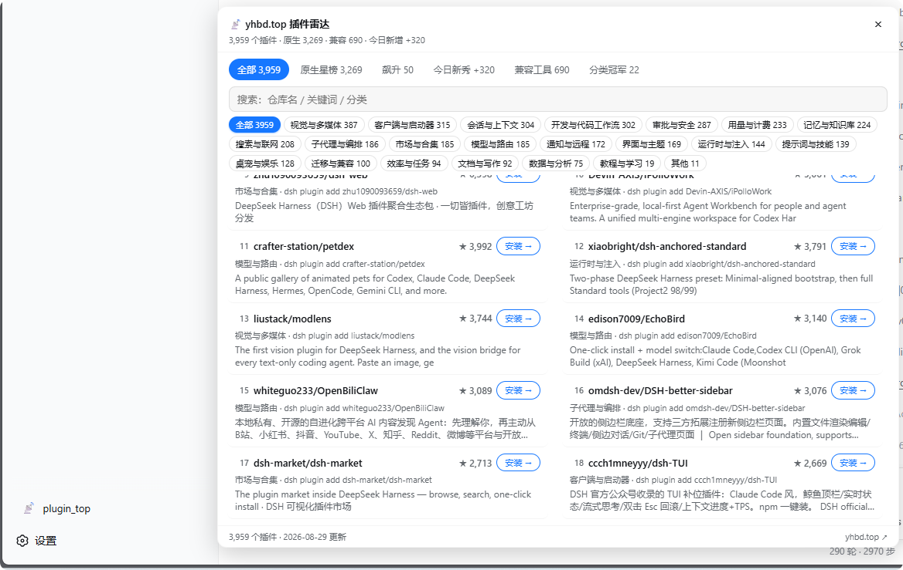

# dsh-plugin-top · DSH 插件雷达

> 侧边栏一键打开 [www.yhbd.top](https://www.yhbd.top) 插件雷达：搜索框 + 22 分类 + 站点同款五榜单（原生星榜 / 飙升 / 今日新秀 / 兼容工具 / 分类冠军），看中哪个点「安装 →」，安装指引直接落进当前会话输入框。



## 你会得到什么

**浏览器侧**（DSH Web 装完即用）：

- 侧边栏底部出现 `📡 plugin_top` 按钮（窄栏只显图标，宽栏带文字）
- 点开大面板（最大 880×700，双栏列表）：顶层 **「全部」**（3900+ 插件全集 ★ 序）+ 站点同款细分榜单——原生星榜（native ★ 全量）· 飙升（▲delta）· 今日新秀（+N）· 兼容工具榜（非 DSH 原生生态）· 分类冠军（每分类 ★ 最高 native，🏆）
- **分类条随榜单联动**：切到哪个榜，分类 chips 只统计**该榜内**的插件分布（如今日新秀 +320 → 分类加总=320）；点分类是**榜内过滤**、不跳回全集；本地即时搜索（仓库名 / 关键词 / 分类，秒响应）可与分类叠加
- 每行右侧「**安装 →**」按钮 → 引导语写入当前会话输入框：`请帮我了解这个 dsh-plugin 社区插件：【项目名称】【github仓库地址】，安装前要做安全审查。`回车即让 Agent **先审查再装**（已有内容自动换行追加，不覆盖）；没有活动会话时降级为复制到剪贴板
- 点仓库名或行空白处 → 新开插件详情页
- 数据由插件内置的同源反代 `/api/plugin-top/data` 拉取，sessionStorage 6h 缓存，深浅色主题跟随 DSH
- ESC / × / 面板外点击关闭

**Agent 侧**（会话里直接说人话）：

| 工具 | 用途 | 示例 |
|---|---|---|
| `plugin_top_search` | 按关键词/分类/星数搜插件，返回简介+安装命令+详情页 | "帮我找个发 QQ 消息的插件" |
| `plugin_top_trending` | 当日新入库 / 近期飙升 / 原生总星榜 | "DSH 插件圈最近有什么新货" |

## 安装

```sh
# 从 GitHub 源码安装（当前主渠道；pnpm 首次 add 需要构建授权：
# 把 pnpm 打印的包键加入 profile 的 pnpm-workspace.yaml → allowBuilds，重试即可；
# 建议锁 commit：github:yhbd-top/dsh-plugin-top#<sha>）
dsh plugin --profile web add github:yhbd-top/dsh-plugin-top

# npm 安装（发布到 registry 后可用）
dsh plugin --profile web add dsh-plugin-top

# 本地 tgz（在仓库目录 npm pack 得到）
dsh plugin --profile web add ./dsh-plugin-top-1.0.0.tgz
```

装好后**重启 DSH**（`schtasks /run /tn DSHWeb` 或你的等效方式）并硬刷新页面，侧边栏即出现 `plugin_top` 按钮。

卸载：`dsh plugin --profile web remove dsh-plugin-top`

## 零依赖部署

本插件把 micro.json 拉取做成 **DSH Web 进程内反向代理**（`/api/plugin-top/data` → `https://www.yhbd.top/data/plugins.micro.json`），所以：

- 不需要 yhbd.top 加 CORS 头
- 不需要 nginx 改任何配置
- 不需要 iframe / CSP frame-ancestors
- 一个插件搞定所有事：用户 `dsh plugin add dsh-plugin-top` 即可使用

唯一前提：DSH Web 进程能访问 `https://www.yhbd.top`（绝大多数部署都满足）。

## 配置（Agent 侧可选）

在 profile 的 `cordis.patch.yml` 里覆盖：

```yaml
- id: plugin-top
  name: dsh-plugin-top
  config:
    baseUrl: https://www.yhbd.top   # 数据源站点（影响 agent 工具 + 浏览器反代源）
    cacheTtlHours: 24               # agent 工具侧目录索引缓存时长
    timeoutMs: 10000                # agent 工具 / 反代拉取超时
```

## 数据与隐私

- 浏览器侧：fetch 同源 `/api/plugin-top/data`，由插件内置反代拉 yhbd.top 静态索引（gzip ~300KB）
- 缓存：`sessionStorage`（关掉标签页即清），不落盘、不跨会话
- Agent 侧缓存：`~/.dsh-plugin-top/micro-cache.json`，断网/站点不可用时自动回退旧缓存并标注日期
- 无任何上传、遥测、凭证；「安装 →」按钮只写输入框，不代发任何消息

## 开发

```sh
npm install
npm run typecheck
npm run build          # tsdown（服务端 ESM，含 webServer 反代路由）+ scripts/build-client.cjs（浏览器 CJS 包裹）
node scripts\smoke-client.cjs   # 模拟 loader 冒烟
# 本机联调（不安装，用 patch overlay 临时加载）：
dsh web --patch ./cordis.local.yml
```

结构说明：

- 服务端：`src/index.ts` → `dist/index.mjs`（cordis bundle，声明 agent 工具 + 挂 `/api/plugin-top/data` 反代路由 + 配置 schema）
- 浏览器端：`src/client.js` → `dist/client.js`（`window.__ModuleLoader__.load` 官方同形包裹，渲染 `sidebar.footer.action` 按钮 + 搜索/分类/榜单面板）
- `package.json` 同时声明 `dsh.bundle.patch` 与 `dsh.client`；**`exports` 必须含 `./package.json`**，否则 client-modules 的 `require.resolve('<pkg>/package.json')` 会静默跳过你的 client bundle（踩过，勿删）

## License

MIT
